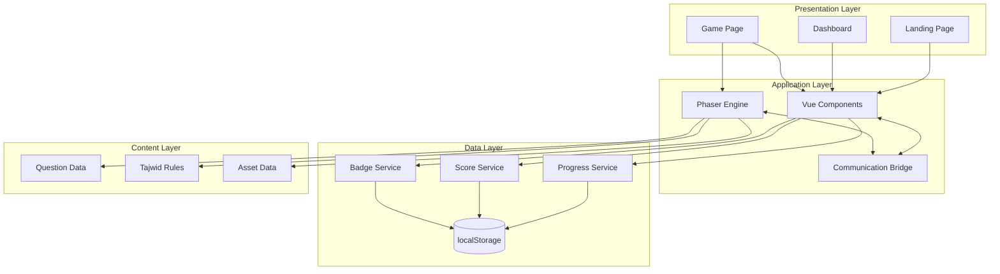

# Design Document: QURRA (Quranic Understanding: Reading Rules Adventure)

## Overview

QURRA is an interactive 2D game-based learning platform designed to teach Tajwid (Quranic recitation rules) through gamification. The system combines a modern web application built with Nuxt 3, Vue 3 Composition API, and Tailwind CSS for the UI layer, with Phaser.js 3 as the game engine for interactive 2D gameplay experiences.

The architecture follows a clear separation of concerns: Vue/Nuxt handles navigation, UI state, and data persistence, while Phaser manages the game canvas, animations, and interactive game mechanics. Communication between these layers occurs through an event-driven bridge pattern.

### Key Design Principles

1. **Framework Separation**: Phaser and Vue operate independently, communicating through events rather than deep integration
2. **Progressive Enhancement**: Core functionality works without advanced features, with PWA capabilities as future enhancement
3. **Islamic Aesthetic**: Consistent visual theme using green, dark blue, gold, and cream colors with Islamic motifs
4. **Responsive First**: Mobile-optimized design with touch-friendly interactions
5. **Client-Side Persistence**: localStorage provides immediate save/load without backend dependency
6. **Type Safety**: TypeScript with strict mode ensures code reliability

## Architecture

### High-Level Architecture



### Layer Responsibilities

**Presentation Layer**: Nuxt 3 pages implementing routing and page-level composition
- Landing page introduces the application and navigates to dashboard
- Dashboard displays progress, scores, badges, and level selection
- Game page hosts the Phaser canvas and game UI overlay

**Application Layer**: Core business logic and game mechanics
- Vue components manage reactive UI state and user interactions
- Phaser engine handles 2D rendering, animations, and game loop
- Communication bridge enables event-based messaging between Vue and Phaser

**Data Layer**: Client-side persistence and state management
- Progress service tracks level completion and question progress
- Score service manages point accumulation and calculations
- Badge service handles achievement unlocking and display
- localStorage provides persistent storage across sessions

**Content Layer**: Static game content and assets
- Question data stores Quranic verse excerpts and answer options
- Tajwid rules contain explanations and educational content
- Asset data includes sprites, images, and audio files

### Technology Stack

**Frontend Framework**: Nuxt 3 with Vue 3 Composition API
- Server-side rendering capability for SEO and initial load performance
- File-based routing simplifies navigation structure
- Auto-imports reduce boilerplate code
- Built-in TypeScript support

**Game Engine**: Phaser 3.60+
- WebGL and Canvas rendering with automatic fallback
- Scene-based architecture for game state management
- Built-in physics engines (Arcade Physics for simplicity)
- Sprite and animation system
- Input handling for mouse, touch, and keyboard

**Styling**: Tailwind CSS 3.x
- Utility-first approach enables rapid UI development
- Custom theme configuration for Islamic color palette
- Responsive design utilities for mobile adaptation
- JIT compiler reduces bundle size

**Type System**: TypeScript 5.x with strict mode
- Type safety across all application code
- Interface definitions for game data structures
- Improved IDE support and refactoring capabilities

**Build Tool**: Vite (included with Nuxt 3)
- Fast hot module replacement during development
- Optimized production builds with code splitting
- Native ESM support

## Components and Interfaces

### Vue Component Structure

```
pages/
├── index.vue                 # Landing Page
├── dashboard.vue             # Dashboard with level selection
└── game/[level].vue          # Dynamic game page per level

components/
├── ui/
│   ├── LandingHero.vue       # Hero section with CTA
│   ├── LevelCard.vue         # Level selection card with progress
│   ├── BadgeDisplay.vue      # Badge showcase component
│   ├── ScoreDisplay.vue      # Score counter component
│   └── ProgressBar.vue       # Visual progress indicator
├── game/
│   ├── PhaserContainer.vue   # Phaser game wrapper component
│   ├── GameOverlay.vue       # UI overlay during gameplay
│   └── FeedbackModal.vue     # Feedback display component
└── layout/
    ├── AppHeader.vue         # Navigation header
    └── AppFooter.vue         # Footer with branding

composables/
├── useGameProgress.ts        # Progress tracking logic
├── useScore.ts               # Score management logic
├── useBadges.ts              # Badge system logic
├── useLocalStorage.ts        # localStorage abstraction
└── usePhaserBridge.ts        # Phaser-Vue communication

types/
├── game.ts                   # Game-related type definitions
├── storage.ts                # Storage data structures
└── tajwid.ts                 # Tajwid content types
```

### Phaser Scene Structure

```
game/
├── config.ts                 # Phaser game configuration
├── scenes/
│   ├── BootScene.ts          # Initial loading scene
│   ├── GameScene.ts          # Main gameplay scene
│   ├── QuestionScene.ts      # Question display scene
│   └── FeedbackScene.ts      # Answer feedback scene
├── entities/
│   ├── Player.ts             # Player character sprite
│   └── Background.ts         # Scrolling background
├── systems/
│   ├── QuestionManager.ts    # Question flow control
│   └── AnimationController.ts # Character animations
└── bridge/
    └── EventBridge.ts        # Vue-Phaser event communication
```

### Key Interfaces

#### Storage Interfaces

```typescript
interface GameProgress {
  version: string;
  levels: LevelProgress[];
  totalScore: number;
  badges: Badge[];
  lastPlayed: string;
}

interface LevelProgress {
  levelId: number;
  levelName: string;
  completed: boolean;
  completionPercentage: number;
  questionsAnswered: number;
  totalQuestions: number;
  bestScore: number;
}

interface Badge {
  id: string;
  levelId: number;
  name: string;
  description: string;
  iconUrl: string;
  unlockedAt: string;
}
```

#### Question Data Interfaces

```typescript
interface Question {
  id: string;
  levelId: number;
  verseText: string;
  verseReference: string;
  highlightRange: [number, number];
  correctAnswer: TajwidRule;
  options: TajwidOption[];
}

interface TajwidRule {
  id: string;
  arabicName: string;
  indonesianName: string;
  category: string;
  explanation: string;
}

type TajwidOption = Pick<
  TajwidRule,
  'id' | 'arabicName' | 'indonesianName'
>;

interface QuestionResult {
  questionId: string;
  selectedAnswer: string | null; // null represents an explicit skip
  correctAnswer: string;
  isCorrect: boolean;
  pointsAwarded: number;
  timestamp: string;
}
```

#### Phaser-Vue Communication Interface

```typescript
interface GameEvents {
  // Events from Vue to Phaser
  'game:start': { levelId: number };
  'game:pause': void;
  'game:resume': void;
  'game:reset': void;
  
  // Events from Phaser to Vue
  'question:answered': QuestionResult;
  'level:completed': { levelId: number; finalScore: number };
  'score:updated': { newScore: number };
  'animation:complete': { animationType: string };
}

interface EventBridge {
  emit<K extends keyof GameEvents>(
    event: K,
    payload: GameEvents[K]
  ): void;
  
  on<K extends keyof GameEvents>(
    event: K,
    handler: (payload: GameEvents[K]) => void
  ): void;
  
  off<K extends keyof GameEvents>(
    event: K,
    handler: (payload: GameEvents[K]) => void
  ): void;
}
```

### Component Integration Patterns

**PhaserContainer Component Pattern**

The PhaserContainer component manages Phaser lifecycle within Vue's reactive system:

```typescript
// Simplified implementation concept
const PhaserContainer = defineComponent({
  setup() {
    const gameRef = ref<HTMLDivElement>();
    const phaserGame = ref<Phaser.Game>();
    const bridge = usePhaserBridge();
    
    onMounted(() => {
      phaserGame.value = new Phaser.Game({
        parent: gameRef.value,
        type: Phaser.AUTO,
        scene: [BootScene, GameScene, QuestionScene, FeedbackScene]
      });
      
      // Connect event bridge
      bridge.connectToGame(phaserGame.value);
    });
    
    onBeforeUnmount(() => {
      bridge.disconnect();
      phaserGame.value?.destroy(true);
    });
    
    return { gameRef };
  }
});
```

**Data Persistence Pattern**

Composables provide reactive localStorage access:

```typescript
// Simplified pattern
export const useGameProgress = () => {
  const progress = ref<GameProgress>(loadProgress());
  
  const updateLevelProgress = (levelId: number, updates: Partial<LevelProgress>) => {
    const level = progress.value.levels.find(l => l.levelId === levelId);
    if (level) {
      Object.assign(level, updates);
      saveProgress(progress.value);
    }
  };
  
  return {
    progress: readonly(progress),
    updateLevelProgress
  };
};
```

## Data Models

### localStorage Schema

```typescript
// Key: 'qurra_game_progress'
{
  "version": "1.0.0",
  "levels": [
    {
      "levelId": 1,
      "levelName": "Nun Sukun & Tanwin",
      "completed": true,
      "completionPercentage": 100,
      "questionsAnswered": 10,
      "totalQuestions": 10,
      "bestScore": 95
    }
    // ... levels 2-5
  ],
  "totalScore": 450,
  "badges": [
    {
      "id": "badge_level_1",
      "levelId": 1,
      "name": "Nun Sukun Master",
      "description": "Completed all Nun Sukun & Tanwin questions",
      "iconUrl": "/badges/nun-sukun-master.svg",
      "unlockedAt": "2024-01-15T10:30:00Z"
    }
  ],
  "lastPlayed": "2024-01-15T10:30:00Z"
}
```

### Question Content Structure

```typescript
// content/questions/level-1-nun-sukun.json
{
  "levelId": 1,
  "levelName": "Nun Sukun & Tanwin",
  "questions": [
    {
      "id": "q1_1",
      "verseText": "مِنْ بَعْدِ مَا",
      "verseReference": "Al-Baqarah 2:87",
      "highlightRange": [0, 4],
      "correctAnswer": {
        "id": "iqlab",
        "arabicName": "إقلاب",
        "indonesianName": "Iqlab",
        "category": "Nun Sukun",
        "explanation": "Nun sukun bertemu huruf Ba dibaca Iqlab: bunyi nun berubah menjadi mim samar disertai dengung."
      },
      "options": [
        {
          "id": "ikhfa",
          "arabicName": "إخفاء",
          "indonesianName": "Ikhfa"
        },
        {
          "id": "idgham",
          "arabicName": "إدغام",
          "indonesianName": "Idgham"
        },
        {
          "id": "iqlab",
          "arabicName": "إقلاب",
          "indonesianName": "Iqlab"
        },
        {
          "id": "izhar",
          "arabicName": "إظهار",
          "indonesianName": "Izhar"
        }
      ]
    }
    // ... more questions
  ]
}
```

### Level Configuration Model

```typescript
interface LevelConfig {
  id: number;
  name: string;
  description: string;
  tajwidCategory: string;
  backgroundTheme: string;
  questionCount: number;
  pointsPerQuestion: number;
  badgeReward: BadgeConfig;
}

const LEVEL_CONFIGS: LevelConfig[] = [
  {
    id: 1,
    name: "Nun Sukun & Tanwin",
    description: "Pelajari hukum bacaan Nun Sukun dan Tanwin",
    tajwidCategory: "nun_sukun",
    backgroundTheme: "desert_journey",
    questionCount: 10,
    pointsPerQuestion: 10,
    badgeReward: {
      id: "badge_level_1",
      name: "Nun Sukun Master",
      iconUrl: "/badges/nun-sukun-master.svg"
    }
  }
  // ... levels 2-5
];
```

### Score Calculation Model

```typescript
interface ScoreCalculation {
  basePoints: number;           // 10 points per correct answer
  timeBonus: number;             // Bonus for quick answers (future)
  streakMultiplier: number;      // Consecutive correct answers (future)
  finalScore: number;
}

// Current simple calculation
const calculateScore = (correctAnswers: number): number => {
  const BASE_POINTS = 10;
  return correctAnswers * BASE_POINTS;
};
```

### Badge System Model

```typescript
interface BadgeConfig {
  id: string;
  name: string;
  description: string;
  iconUrl: string;
  unlockCondition: BadgeCondition;
}

interface BadgeCondition {
  type: 'level_completion' | 'score_threshold' | 'streak' | 'perfect_score';
  levelId?: number;
  scoreRequired?: number;
  streakRequired?: number;
}

const BADGE_DEFINITIONS: BadgeConfig[] = [
  {
    id: "badge_level_1",
    name: "Nun Sukun Master",
    description: "Selesaikan semua soal Level 1",
    iconUrl: "/badges/nun-sukun-master.svg",
    unlockCondition: {
      type: 'level_completion',
      levelId: 1
    }
  }
  // ... badges for levels 2-5
];
```

## Correctness Properties

*A property is a characteristic or behavior that should hold true across all valid executions of a system—essentially, a formal statement about what the system should do. Properties serve as the bridge between human-readable specifications and machine-verifiable correctness guarantees.*

Before defining properties, let me analyze the acceptance criteria for testability:


### Property Reflection

After analyzing all acceptance criteria, I've identified the following properties suitable for property-based testing. Let me review for redundancy:

**Progress and Score Display**: Requirements 2.2 (progress display), 2.3 (score display), and 10.4 (progress percentage display) all test that data is correctly rendered. These can be combined into a single property about state-to-UI consistency.

**localStorage Round-trips**: Requirements 3.2, 6.3, 8.3, 9.3, 10.1 all test localStorage persistence. These are all instances of the same round-trip property: data saved should equal data retrieved.

**Score Increment**: Requirements 6.2 and 8.2 are identical - both test that correct answers add 10 points.

**Question Progression**: Requirements 6.4 and 7.4 both test moving to the next question after feedback, just with different answer correctness.

**Badge Awarding**: Requirements 3.5 and 9.2 both test that completing a level awards the corresponding badge.

**Feedback Display**: Requirements 6.1 and 7.1/7.2 all test that feedback appears, just for different answer correctness.

After eliminating redundancies and combining related properties, here are the unique, comprehensive properties:

### Property 1: Score Increment Consistency

*For any* initial score value and any correct answer submission, the system SHALL increase the score by exactly 10 points.

**Validates: Requirements 6.2, 8.2**

### Property 2: Score Immutability on Incorrect Answers

*For any* initial score value and any incorrect answer submission, the system SHALL maintain the score unchanged.

**Validates: Requirements 7.3**

### Property 3: localStorage Persistence Round-Trip

*For any* valid GameProgress object (including scores, level completion, and badges), saving to localStorage then retrieving SHALL produce an equivalent object.

**Validates: Requirements 3.2, 6.3, 8.3, 9.3, 10.1, 10.5**

### Property 4: Level-Badge Mapping Consistency

*For any* level completion event, the system SHALL award the badge with matching levelId and exactly one badge per level.

**Validates: Requirements 3.5, 9.2**

### Property 5: Progress Percentage Calculation

*For any* level with a defined total question count and answered question count, the displayed progress percentage SHALL equal (answeredQuestions / totalQuestions) × 100 rounded to nearest integer.

**Validates: Requirements 2.2, 10.2, 10.4**

### Property 6: Question Sequence Ordering

*For any* question set for a given level, questions SHALL be displayed in the order they appear in the question array with sequential indexing.

**Validates: Requirements 5.1**

### Property 7: Answer Evaluation Correctness

*For any* question and any selected answer option, the evaluation SHALL return true if and only if the selected answer ID matches the question's correctAnswer ID.

**Validates: Requirements 5.4**

### Property 8: Single Submission Enforcement

*For any* question, after one answer submission, subsequent submission attempts SHALL be rejected and have no effect on game state.

**Validates: Requirements 5.5**

### Property 9: Feedback Display for All Answers

*For any* answer submission (correct or incorrect), feedback SHALL be displayed with appropriate content: positive message for correct, correct rule explanation for incorrect.

**Validates: Requirements 6.1, 7.1, 7.2**

### Property 10: Question State Progression

*For any* question in a sequence (not the last), after answer submission and feedback display, the system SHALL transition to the next question in the sequence.

**Validates: Requirements 6.4, 7.4**

### Property 11: Badge Display Completeness

*For any* set of earned badges in player progress, the dashboard SHALL display exactly those badges with no omissions or additions.

**Validates: Requirements 2.4, 9.4**

### Property 12: Total Score Aggregation

*For any* collection of level attempts with individual scores, the displayed total score SHALL equal the sum of all level scores.

**Validates: Requirements 8.5**

### Property 13: Level Accessibility Invariant

*For any* level and any completion status (completed or not), the level SHALL remain accessible and playable.

**Validates: Requirements 3.4**

### Property 14: Navigation Route Mapping

*For any* valid level ID (1-5), selecting that level SHALL navigate to the route `/game/[levelId]`.

**Validates: Requirements 2.5**

### Property 15: Question Option Count Constraint

*For any* question in the system, the number of answer options SHALL be between 3 and 5 inclusive.

**Validates: Requirements 5.3**

### Property 16: Verse Text Display Consistency

*For any* question, the displayed verse text SHALL exactly match the verseText property from the question data.

**Validates: Requirements 5.2**

### Property 17: Highlight Range Correspondence

*For any* incorrect answer feedback, the highlighted text range SHALL correspond to the question's highlightRange indices in the verse text.

**Validates: Requirements 7.5**

### Property 18: Question Data Structure Validity

*For any* question file in the content directory, parsing as JSON SHALL succeed and conform to the Question interface schema.

**Validates: Requirements 13.4**

### Property 19: Tajwid Explanation Conciseness

*For any* tajwid rule explanation, when split by sentence terminators (. ! ?), the sentence count SHALL be at most 3.

**Validates: Requirements 13.6**

### Property 20: Canvas Proportional Scaling

*For any* viewport dimension change, the game canvas aspect ratio SHALL remain constant (width/height ratio unchanged).

**Validates: Requirements 11.5**

### Property 21: Touch Target Minimum Size

*For any* interactive UI element on mobile viewport (<768px), both width and height SHALL be at least 44 pixels.

**Validates: Requirements 11.6**

### Property 22: Navigation Performance Bound

*For any* valid route transition in the application, the navigation completion time SHALL not exceed 200 milliseconds under normal conditions.

**Validates: Requirements 16.6**

### Property 23: Error Logging Completeness

*For any* runtime error caught by the application, an entry SHALL be written to the browser console.

**Validates: Requirements 17.4**

### Property 24: Error Recovery Options Availability

*For any* error state display, the UI SHALL provide at least one recovery action (dashboard navigation or retry operation).

**Validates: Requirements 17.6**

## Error Handling

### Error Categories and Handling Strategies

**1. Game Engine Initialization Errors**

When Phaser.js fails to initialize (WebGL unavailable, canvas creation failure, or configuration errors), the system implements graceful degradation:

```typescript
interface GameInitError {
  type: 'engine_init_failure';
  cause: 'webgl_unavailable' | 'canvas_failed' | 'config_invalid';
  message: string;
  fallbackAvailable: boolean;
}
```

- Display error modal with clear explanation
- Show fallback UI with static educational content
- Provide button to return to dashboard
- Log full error details to console for debugging

**2. localStorage Errors**

localStorage can fail due to quota limits, privacy settings, or browser restrictions:

```typescript
interface StorageError {
  type: 'storage_failure';
  cause: 'quota_exceeded' | 'access_denied' | 'not_available';
  message: string;
  recoverable: boolean;
}
```

Handling strategy:
- Quota exceeded: Warn user, offer to clear old data, implement data pruning
- Access denied: Inform user that progress won't save, allow temporary session play
- Not available: Fall back to in-memory state management with session warning

**3. Question Data Loading Errors**

Network failures or corrupted data files can prevent question loading:

```typescript
interface DataLoadError {
  type: 'data_load_failure';
  resource: string;
  cause: 'network' | 'parse_error' | 'missing';
  retryable: boolean;
}
```

Handling strategy:
- Display error message with specific failure reason
- Provide retry button with exponential backoff
- If repeated failures, suggest checking connection
- Allow navigation back to dashboard

**4. Runtime JavaScript Errors**

Unhandled errors could crash the application:

```typescript
// Vue 3 global error handler
app.config.errorHandler = (err, instance, info) => {
  console.error('Runtime error:', err, info);
  // Log to error tracking service if available
  showErrorBoundaryUI();
};

// Phaser error events
game.events.on('error', (error) => {
  console.error('Phaser error:', error);
  handleGameError(error);
});
```

Error boundaries ensure:
- Application remains functional after component errors
- User sees friendly error message instead of blank screen
- Error details logged for debugging
- Recovery options provided (reload component, return to dashboard)

### Error Recovery Workflows

**Automatic Recovery**
- localStorage quota: Automatically prune oldest progress data if quota exceeded
- Network timeouts: Automatic retry with exponential backoff (1s, 2s, 4s)
- Phaser scene errors: Restart scene if safe, otherwise navigate to dashboard

**User-Initiated Recovery**
- Retry buttons for data loading failures
- "Return to Dashboard" button always available in error states
- "Clear Data" option for persistent storage issues
- Manual refresh suggestion for unrecoverable errors

### Error Prevention Strategies

**Input Validation**
- Validate all question data against TypeScript interfaces at load time
- Verify localStorage data schema before parsing
- Check Phaser configuration before initialization

**Defensive Programming**
- Null checks before accessing nested properties
- Try-catch blocks around external API calls (localStorage, Phaser)
- Default fallbacks for missing configuration

**Progressive Enhancement**
- Core gameplay doesn't depend on localStorage (can run in-memory)
- Game works without WebGL (Canvas fallback)
- UI functional without animations

## Testing Strategy

### Testing Approach Overview

QURRA will use a **dual testing approach** combining property-based testing with traditional example-based testing to ensure comprehensive coverage:

1. **Property-Based Tests**: Verify universal properties across randomized inputs using fast-check library
2. **Example-Based Unit Tests**: Test specific scenarios, edge cases, and integration points
3. **Integration Tests**: Verify Phaser-Vue communication and localStorage interactions
4. **Visual Regression Tests**: Ensure UI consistency across viewport sizes
5. **Performance Tests**: Validate load time and navigation speed requirements

### Property-Based Testing Implementation

**Library Selection**: fast-check for TypeScript/JavaScript
- Mature, well-maintained library with extensive generators
- Strong TypeScript support with type inference
- Configurable iteration counts and shrinking for minimal counterexamples

**Configuration Standards**
- Minimum 100 iterations per property test (due to randomization)
- Each test tagged with reference to design document property
- Tag format: `// Feature: qurra-game, Property {number}: {property_text}`

**Example Property Test Structure**

```typescript
import fc from 'fast-check';
import { describe, it, expect } from 'vitest';

describe('Score Management Properties', () => {
  it('Property 1: Score increment consistency', () => {
    // Feature: qurra-game, Property 1: Score Increment Consistency
    fc.assert(
      fc.property(
        fc.integer({ min: 0, max: 10000 }), // initial score
        (initialScore) => {
          const newScore = incrementScore(initialScore);
          expect(newScore).toBe(initialScore + 10);
        }
      ),
      { numRuns: 100 }
    );
  });

  it('Property 2: Score immutability on incorrect answers', () => {
    // Feature: qurra-game, Property 2: Score Immutability on Incorrect Answers
    fc.assert(
      fc.property(
        fc.integer({ min: 0, max: 10000 }),
        (initialScore) => {
          const score = handleIncorrectAnswer(initialScore);
          expect(score).toBe(initialScore);
        }
      ),
      { numRuns: 100 }
    );
  });
});
```

### Unit Testing Strategy

**Testing Scope**
- Composables: Test state management logic in isolation
- Components: Test rendering and user interactions with Vue Test Utils
- Utility functions: Test pure functions with example inputs
- Phaser scenes: Test scene lifecycle and state transitions

**Example-Based Test Focus Areas**
1. **Specific Business Rules**
   - Exactly 5 levels are defined
   - Badge IDs match level IDs
   - Initial score is 0 for new players

2. **Edge Cases**
   - Empty localStorage
   - Last question in a level
   - Completing all levels
   - Invalid level IDs in navigation

3. **Error Scenarios**
   - localStorage unavailable
   - Question data missing
   - Phaser initialization failure

4. **UI Interactions**
   - Button click handlers
   - Route navigation
   - Modal open/close

**Balance Principle**: Keep unit test count moderate. Property tests handle input variation coverage. Unit tests focus on specific scenarios not captured by properties.

### Integration Testing

**Phaser-Vue Communication Tests**
```typescript
describe('Event Bridge Integration', () => {
  it('should emit question answered event from Phaser to Vue', async () => {
    const bridge = createEventBridge();
    const handler = vi.fn();
    
    bridge.on('question:answered', handler);
    
    // Simulate Phaser emitting event
    bridge.emit('question:answered', {
      questionId: 'q1_1',
      isCorrect: true,
      pointsAwarded: 10
    });
    
    expect(handler).toHaveBeenCalledWith(
      expect.objectContaining({ isCorrect: true })
    );
  });
});
```

**localStorage Integration Tests**
```typescript
describe('Progress Persistence', () => {
  beforeEach(() => {
    localStorage.clear();
  });

  it('should persist and retrieve progress data', () => {
    const progress: GameProgress = {
      version: '1.0.0',
      levels: [/* mock data */],
      totalScore: 100,
      badges: [],
      lastPlayed: new Date().toISOString()
    };
    
    saveProgress(progress);
    const retrieved = loadProgress();
    
    expect(retrieved).toEqual(progress);
  });
});
```

### Visual Regression Testing

**Approach**: Snapshot testing for critical UI components at different viewport sizes

**Tools**: Vitest + happy-dom for rendering, manual checks for Islamic theme consistency

**Test Coverage**
- Landing page at mobile and desktop viewports
- Dashboard with various progress states
- Game UI overlay
- Feedback modals (correct and incorrect)
- Badge display

**Implementation Pattern**
```typescript
describe('Dashboard Visual Regression', () => {
  it('should render correctly at desktop viewport', () => {
    const { container } = render(Dashboard, {
      global: {
        stubs: {
          NuxtLink: true
        }
      }
    });
    
    expect(container).toMatchSnapshot();
  });
});
```

### Performance Testing

**Load Time Validation**
- Use Lighthouse CI in automated pipeline
- Target: Desktop score ≥80, Mobile score ≥70
- Run on production build

**Navigation Performance**
```typescript
describe('Navigation Performance', () => {
  it('should complete route transitions within 200ms', async () => {
    const start = performance.now();
    await router.push('/dashboard');
    const duration = performance.now() - start;
    
    expect(duration).toBeLessThan(200);
  });
});
```

**Bundle Size Monitoring**
- Track bundle sizes in CI/CD
- Alert on significant increases
- Verify code splitting: Phaser loads only on game routes

### Test Organization

```
tests/
├── unit/
│   ├── composables/
│   │   ├── useGameProgress.test.ts
│   │   ├── useScore.test.ts
│   │   └── useBadges.test.ts
│   ├── components/
│   │   ├── LevelCard.test.ts
│   │   └── BadgeDisplay.test.ts
│   └── utils/
│       └── score-calculator.test.ts
├── properties/
│   ├── score-properties.test.ts
│   ├── storage-properties.test.ts
│   ├── question-properties.test.ts
│   └── navigation-properties.test.ts
├── integration/
│   ├── phaser-vue-bridge.test.ts
│   ├── localStorage-persistence.test.ts
│   └── question-flow.test.ts
└── visual/
    ├── landing-page.test.ts
    └── dashboard.test.ts
```

### Testing Workflow

**During Development**
1. Write property tests first for core business logic
2. Add example-based tests for specific scenarios
3. Run tests in watch mode during implementation
4. Verify test coverage stays above 80% for logic code

**Pre-Commit**
- Run unit and property tests
- Run linter and type checker
- Fast checks only (skip slow integration tests)

**CI/CD Pipeline**
- Run all tests including integration
- Run Lighthouse performance audit
- Check bundle sizes
- Run visual regression tests
- Generate coverage report

### Coverage Goals

**Code Coverage Targets**
- Composables and utilities: 90%+ coverage
- Components: 75%+ coverage (excluding purely visual elements)
- Phaser game logic: 80%+ coverage
- Overall: 80%+ coverage

**Property Coverage**
- All 24 identified properties implemented as tests
- Each property test runs minimum 100 iterations
- Counterexamples investigated and fixed

**Scenario Coverage**
- All error handling paths tested
- All user workflows covered (happy paths and error cases)
- All localStorage scenarios (available, unavailable, quota exceeded)
- All navigation routes tested

